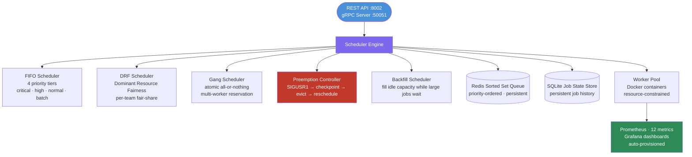
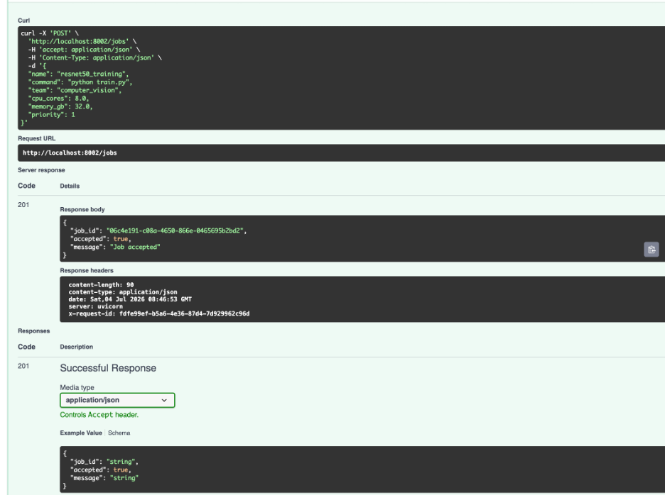
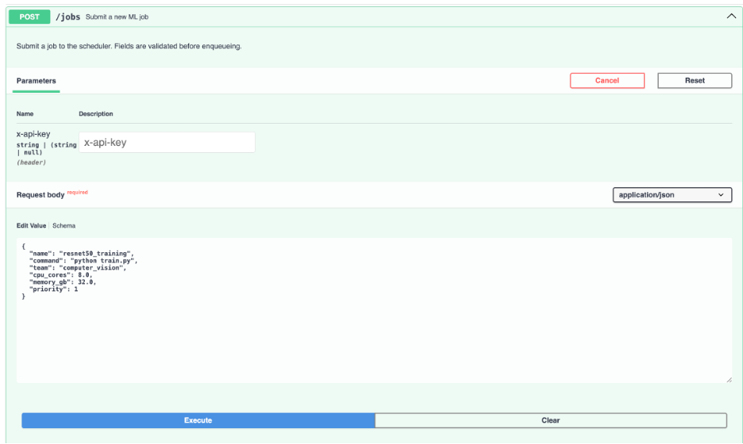
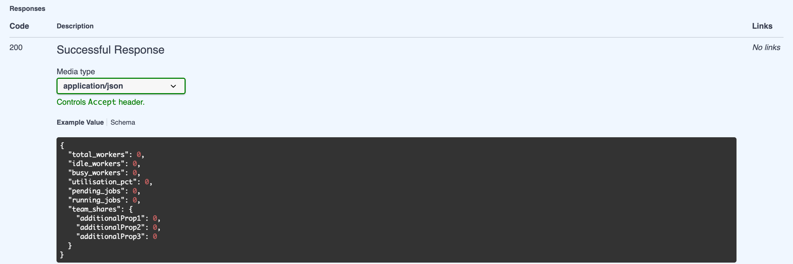
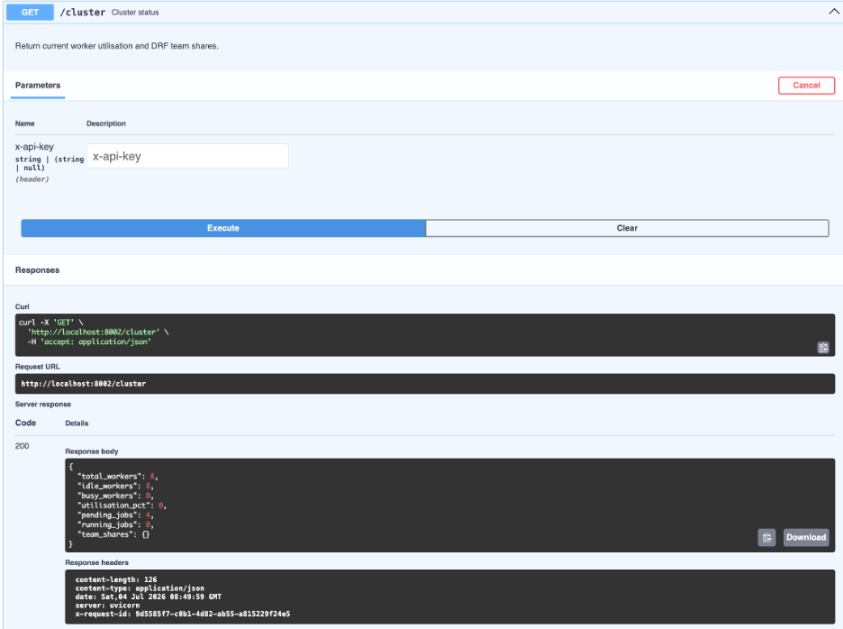

<p align="center">
  
</p>

<h1 align="center">Lattice</h1>

<p align="center">
  <strong>Distributed ML Job Scheduler</strong>
</p>

<p align="center">
  Multi-tenant ML job scheduler with FIFO, DRF, gang scheduling, preemption, and backfill.
  Built for local simulation on Apple Silicon with Redis, SQLite, Docker, Prometheus, and Grafana.
</p>

<p align="center">
  
  
  
  
  
</p>

---

## Overview

**Lattice** is a local-first simulation of a distributed ML job scheduler. It allocates compute resources across teams and job types using five scheduling strategies:

* FIFO with priority tiers
* Dominant Resource Fairness
* Gang scheduling
* Preemption with checkpoint/restore
* Backfill scheduling

Jobs are submitted through a REST API, stored in Redis and SQLite, executed through simulated Docker workers, and monitored through Prometheus and Grafana.

> **Simulation note:** Lattice simulates a multi-worker ML cluster locally using Docker containers and resource accounting. The scheduling algorithms are real and architecture-agnostic, but worker execution is simulated using timed jobs rather than actual distributed GPU workloads.

---

## Why It Matters

Production ML clusters cannot rely on naive FIFO queues. Real systems must handle:

* large jobs blocking smaller jobs
* teams competing for shared resources
* multi-worker jobs requiring atomic placement
* critical jobs preempting low-priority workloads
* idle cluster gaps that can be filled by smaller jobs

Lattice implements the scheduling concepts behind systems such as YARN, Kubernetes schedulers, and Slurm in a local, observable, interview-ready system.

---

## Architecture



---

## Scheduling Algorithms

| Algorithm                      | Purpose                                                                               |
| ------------------------------ | ------------------------------------------------------------------------------------- |
| **FIFO with priority tiers**   | Keeps ordering simple while ensuring critical jobs do not wait behind batch workloads |
| **Dominant Resource Fairness** | Prevents one team from monopolizing CPU or memory                                     |
| **Gang scheduling**            | Starts multi-worker jobs atomically only when all required workers are available      |
| **Preemption**                 | Evicts lower-priority jobs to unblock critical workloads                              |
| **Backfill**                   | Runs smaller jobs in idle gaps while larger jobs wait for resources                   |

---

## Features

* **5 scheduling algorithms**: FIFO, DRF, gang scheduling, preemption, and backfill
* **REST job submission API** using FastAPI
* **gRPC worker communication** through generated protocol stubs
* **Redis Sorted Set queue** for priority-ordered job dispatch
* **SQLite job store** for persistent job lifecycle tracking
* **Multi-tenant fairness** with per-team DRF share calculation
* **Simulated worker pool** using Docker container lifecycle management
* **Preemption controller** using SIGUSR1-style checkpoint/restore semantics
* **200-job stress simulation** for local scheduling demonstrations
* **FIFO vs DRF utilization report** generated through simulation scripts
* **12 Prometheus metrics** for scheduler and cluster observability
* **Grafana dashboards** auto-provisioned from repository configuration

---

## Tech Stack

| Area       | Tools                                |
| ---------- | ------------------------------------ |
| API        | FastAPI, gRPC                        |
| Scheduling | Python, asyncio, Pydantic            |
| Queue      | Redis Sorted Sets                    |
| State      | SQLite                               |
| Workers    | Docker                               |
| Metrics    | Prometheus                           |
| Dashboards | Grafana                              |
| Simulation | Python scripts, local Docker workers |

---

## Project Structure

```text
lattice/
├── proto/lattice.proto              # gRPC service definition
├── lattice/
│   ├── scheduler.py                 # Core async scheduler engine
│   ├── algorithms/
│   │   ├── fifo.py                  # FIFO + priority queue
│   │   ├── drf.py                   # Dominant Resource Fairness
│   │   ├── gang.py                  # Gang scheduling
│   │   ├── preemption.py            # Preemption controller
│   │   └── backfill.py              # Backfill scheduler
│   ├── worker/
│   │   ├── pool.py                  # Worker pool manager
│   │   ├── docker_worker.py         # Docker container lifecycle
│   │   └── agent.py                 # Worker gRPC agent
│   ├── store/
│   │   ├── job_store.py             # SQLite job state persistence
│   │   └── redis_queue.py           # Redis Sorted Set queue
│   ├── api/
│   │   ├── grpc_server.py           # gRPC service implementation
│   │   └── rest_api.py              # FastAPI admin REST API
│   ├── metrics.py                   # Prometheus metrics
│   └── models.py                    # Pydantic + dataclass models
├── config/config.yaml               # Tunable scheduler parameters
├── tests/                           # Pytest test suite
├── simulation/
│   ├── stress_test.py               # 200-job simulation
│   └── utilisation_report.py        # FIFO vs DRF comparison chart
└── docker-compose.yml               # Redis + Prometheus + Grafana
```

---

## Quickstart

### 1. Install dependencies

```bash
cd lattice
pip install -r requirements.txt
```

### 2. Generate gRPC stubs

```bash
python -m grpc_tools.protoc \
  -I proto \
  --python_out=lattice/proto_gen \
  --grpc_python_out=lattice/proto_gen \
  proto/lattice.proto
```

### 3. Start infrastructure

```bash
docker compose up redis prometheus grafana -d
```

### 4. Start Lattice

REST API only:

```bash
uvicorn lattice.api.rest_api:app --port 8002 --reload
```

Full mode:

```bash
python -m lattice.main
```

### 5. Run tests

```bash
pytest tests/ -v
```

---

## API Usage

### Submit a job

```bash
curl -X POST http://localhost:8002/jobs \
  -H "Content-Type: application/json" \
  -d '{
    "team": "team_A",
    "name": "bert-finetune",
    "priority": 2,
    "cpu_cores": 2.0,
    "memory_gb": 4.0,
    "num_workers": 1,
    "estimated_duration_seconds": 300
  }'
```

### REST Endpoints

| Method | Endpoint     | Description                        |
| ------ | ------------ | ---------------------------------- |
| POST   | `/jobs`      | Submit a job                       |
| DELETE | `/jobs/{id}` | Cancel a job                       |
| GET    | `/jobs/{id}` | Get job status                     |
| GET    | `/jobs`      | List jobs by team or state         |
| GET    | `/cluster`   | Cluster status and DRF share table |
| GET    | `/metrics`   | Prometheus metrics                 |
| GET    | `/health`    | Health check                       |

---

## Simulations

### Run 200-job stress simulation

```bash
python simulation/stress_test.py
```

### Generate FIFO vs DRF utilization report

```bash
python simulation/utilisation_report.py
open utilisation_report.png
```

---

## Observability

Lattice exposes Prometheus metrics at:

```text
http://localhost:8002/metrics
```

Grafana runs at:

```text
http://localhost:3000
```

Default login:

```text
admin / lattice
```

### Metrics

| Metric                                 | Type      | Description                          |
| -------------------------------------- | --------- | ------------------------------------ |
| `lattice_cluster_utilisation_ratio`    | Gauge     | Overall cluster utilization          |
| `lattice_drf_dominant_share{team}`     | Gauge     | DRF dominant share per team          |
| `lattice_preemptions_total`            | Counter   | Preemption events                    |
| `lattice_gang_schedule_attempts_total` | Counter   | Gang scheduling outcomes             |
| `lattice_backfill_jobs_total`          | Counter   | Backfill-scheduled jobs              |
| `lattice_jobs_submitted_total`         | Counter   | Job submissions by team and priority |
| `lattice_jobs_completed_total`         | Counter   | Job completions by team and status   |
| `lattice_job_wait_seconds`             | Histogram | Queue wait time                      |
| `lattice_job_duration_seconds`         | Histogram | Wall-clock job duration              |
| `lattice_queue_depth{priority}`        | Gauge     | Pending jobs per priority tier       |
| `lattice_workers{state}`               | Gauge     | Workers by state                     |
| `lattice_uptime_seconds`               | Gauge     | Scheduler uptime                     |

---

## Screenshots










---

## Tests

```bash
pytest tests/ -v
```

With coverage:

```bash
pytest tests/ -v --cov=lattice
```

The test suite covers FIFO scheduling, DRF fair-share, gang scheduling, preemption, backfill, job store, Redis queue, REST API, and metrics.

---

## Known Limitations

* **Simulated execution**: Workers run jobs as timed sleeps with resource accounting rather than real ML workloads.
* **Single-machine simulation**: Lattice does not distribute work across multiple physical nodes.
* **Preemption requires cooperative workloads**: Real checkpointing would require jobs to handle the preemption signal and save state.
* **Docker required for worker lifecycle**: Worker operations depend on Docker; tests mock this where possible.
* **Resource isolation is tracked, not fully enforced**: CPU and memory requirements are tracked in scheduler state, but OS-level enforcement would require cgroups or Kubernetes ResourceQuota.
* **gRPC stubs must be generated**: Run the gRPC generation command before using worker gRPC communication.

---

## Future Work

* Real compute execution through subprocess or Docker exec
* cgroup-based resource enforcement
* Multi-machine worker distribution through remote gRPC agents
* Kubernetes operator mode with custom resources
* MinIO-backed checkpoint storage
* Priority inversion detection and mitigation
* Live scheduler dashboard UI

---

## Resume Bullet

Built a distributed ML job scheduler simulation with FIFO, Dominant Resource Fairness, gang scheduling, preemption, and backfill, using Redis-backed queues, SQLite job state, Docker worker simulation, and Prometheus/Grafana observability.
