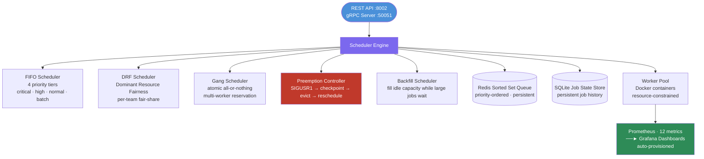

# Lattice — Distributed ML Job Scheduler

Multi-tenant ML job scheduler with 5 scheduling algorithms. Workers are simulated Docker containers with resource constraints. Built for Apple Silicon. $0 budget. Fully local.

---

## What it does

Lattice allocates compute resources across teams and job types using five scheduling algorithms: FIFO with priority tiers, Dominant Resource Fairness (DRF), gang scheduling, preemption with checkpoint/restore, and backfill. Job state is tracked in Redis and SQLite. Workers are Docker containers controlled by Lattice's worker pool. Scheduling decisions are exposed via Prometheus metrics and a Grafana dashboard.

> **Simulation note**: Lattice simulates a multi-worker ML cluster locally using Docker containers with resource constraints. Scheduling algorithms are architecture-agnostic and implement the same logic as production cluster schedulers (YARN, Kubernetes scheduler, Slurm). Worker execution is simulated — jobs run as timed sleeps with resource accounting rather than actual compute workloads.

---

## Why it matters

Production ML clusters face scheduling problems that naive FIFO queues cannot solve: large jobs starving small ones, teams monopolizing shared resources, multi-GPU jobs needing atomic allocation, preempting low-priority jobs to unblock critical ones. Lattice implements the scheduling algorithms used in real systems (YARN's DRF, Kubernetes gang scheduling, Slurm backfill) as a local demonstrable system with Prometheus observability.

---

## Architecture



---

## Scheduling Algorithms

| Algorithm | What it solves |
|-----------|---------------|
| **FIFO** (4 priority tiers) | Simple ordered queue; critical jobs never wait behind batch |
| **DRF** (Dominant Resource Fairness) | Per-team fair-share; no team monopolizes CPU or memory |
| **Gang scheduling** | Multi-worker jobs start atomically or not at all |
| **Preemption** | High-priority job evicts low-priority job; state saved via SIGUSR1 → checkpoint |
| **Backfill** | Small jobs fill idle gaps while large jobs queue; reduces idle cluster time |

---

## Features

- **5 scheduling algorithms**: FIFO, DRF, gang, preemption, backfill
- **Job submission API**: REST (FastAPI) and gRPC worker communication
- **Multi-tenant**: per-team resource tracking and DRF fair-share allocation
- **Preemption**: SIGUSR1-based checkpoint/restore (simulated via `torch.save` convention)
- **Redis Sorted Set queue**: priority-ordered, persistent across restarts
- **SQLite job state store**: full job lifecycle history
- **Worker pool**: Docker container lifecycle management
- **200-job stress simulation**: demonstrable cluster behaviour under load
- **FIFO vs DRF utilisation chart**: generated by `utilisation_report.py`
- **12 Prometheus metrics**: cluster utilisation, DRF shares, preemptions, gang attempts, backfill counts
- **Grafana dashboards**: auto-provisioned via `grafana/provisioning/`

---

## Tech Stack

Python · FastAPI · gRPC · Redis · SQLite · Docker · Prometheus · Grafana · asyncio · Pydantic

---

## Project Structure

```
lattice/
├── proto/lattice.proto              # gRPC service definition
├── lattice/
│   ├── scheduler.py                 # Core async scheduler engine
│   ├── algorithms/
│   │   ├── fifo.py                  # FIFO + priority queue
│   │   ├── drf.py                   # Dominant Resource Fairness
│   │   ├── gang.py                  # Gang scheduling
│   │   ├── preemption.py            # Preemption controller
│   │   └── backfill.py              # Backfill scheduler
│   ├── worker/
│   │   ├── pool.py                  # Worker pool manager
│   │   ├── docker_worker.py         # Docker container lifecycle
│   │   └── agent.py                 # Worker gRPC agent
│   ├── store/
│   │   ├── job_store.py             # SQLite job state persistence
│   │   └── redis_queue.py           # Redis Sorted Set queue
│   ├── api/
│   │   ├── grpc_server.py           # gRPC service implementation
│   │   └── rest_api.py              # FastAPI admin REST API
│   ├── metrics.py                   # 12 Prometheus metrics
│   └── models.py                    # Pydantic + dataclass models
├── config/config.yaml               # All tunable parameters
├── tests/                           # 32+ pytest tests (all mocked)
├── simulation/
│   ├── stress_test.py               # 200-job live simulation
│   └── utilisation_report.py        # FIFO vs DRF chart
└── docker-compose.yml               # Redis + Prometheus + Grafana
```

---

## Quickstart

### 1. Install dependencies

```bash
cd lattice
pip install -r requirements.txt
```

### 2. Generate gRPC stubs

```bash
cd lattice
python -m grpc_tools.protoc \
  -I proto \
  --python_out=lattice/proto_gen \
  --grpc_python_out=lattice/proto_gen \
  proto/lattice.proto
```

### 3. Start infrastructure

```bash
cd lattice
docker compose up redis prometheus grafana -d
```

### 4. Start Lattice

```bash
cd lattice
# REST API only
uvicorn lattice.api.rest_api:app --port 8002 --reload

# Or full mode (scheduler + REST + gRPC)
python -m lattice.main
```

### 5. Run tests (no Docker or Redis needed)

```bash
cd lattice
pytest tests/ -v
```

### 6. Run 200-job stress simulation

```bash
cd lattice
python simulation/stress_test.py
```

### 7. Generate FIFO vs DRF utilisation report

```bash
cd lattice
python simulation/utilisation_report.py
# Outputs: utilisation_report.png
```

---

## API Usage

### Submit a job

```bash
curl -X POST http://localhost:8002/jobs \
  -H "Content-Type: application/json" \
  -d '{
    "team": "team_A",
    "name": "bert-finetune",
    "priority": 2,
    "cpu_cores": 2.0,
    "memory_gb": 4.0,
    "num_workers": 1,
    "estimated_duration_seconds": 300
  }'
```

### REST Endpoints

| Method | Endpoint | Description |
|--------|----------|-------------|
| POST | `/jobs` | Submit a job |
| DELETE | `/jobs/{id}` | Cancel a job |
| GET | `/jobs/{id}` | Get job status |
| GET | `/jobs` | List jobs (filter by team/state) |
| GET | `/cluster` | Cluster status + DRF share table |
| GET | `/metrics` | Prometheus metrics |
| GET | `/health` | Health check |

---

## Tests

```bash
# Run all tests (no Docker or Redis needed — all mocked)
pytest tests/ -v

# With coverage
pytest tests/ -v --cov=lattice
```

32+ tests covering: FIFO scheduling, DRF fair-share, gang scheduling, preemption, backfill, job store, Redis queue, REST API, metrics.

---

## Observability

### Prometheus metrics (at `/metrics`)

| Metric | Type | Description |
|--------|------|-------------|
| `lattice_cluster_utilisation_ratio` | Gauge | Overall cluster utilisation (target: >0.80) |
| `lattice_drf_dominant_share{team}` | Gauge | DRF dominant share per team |
| `lattice_preemptions_total` | Counter | Preemption events |
| `lattice_gang_schedule_attempts_total` | Counter | Gang scheduling outcomes |
| `lattice_backfill_jobs_total` | Counter | Backfill-scheduled jobs |
| `lattice_jobs_submitted_total` | Counter | Submissions by team/priority |
| `lattice_jobs_completed_total` | Counter | Completions by team/status |
| `lattice_job_wait_seconds` | Histogram | Queue wait time |
| `lattice_job_duration_seconds` | Histogram | Wall-clock duration |
| `lattice_queue_depth{priority}` | Gauge | Pending jobs per tier |
| `lattice_workers{state}` | Gauge | Workers by state |
| `lattice_uptime_seconds` | Gauge | Scheduler uptime |

### Grafana

- URL: http://localhost:3000 (admin / lattice)
- Dashboards are auto-provisioned via `grafana/provisioning/`

---

## Demo

```bash
# Navigate to lattice directory
cd lattice

# Start Lattice
uvicorn lattice.api.rest_api:app --port 8002 --reload

# Submit jobs from different teams
curl -X POST http://localhost:8002/jobs \
  -d '{"team": "team_A", "name": "gpt-finetune", "priority": 3, "cpu_cores": 4.0, "memory_gb": 8.0, "num_workers": 2, "estimated_duration_seconds": 600}'

curl -X POST http://localhost:8002/jobs \
  -d '{"team": "team_B", "name": "bert-eval", "priority": 1, "cpu_cores": 1.0, "memory_gb": 2.0, "num_workers": 1, "estimated_duration_seconds": 120}'

# Check cluster state (DRF shares)
curl http://localhost:8002/cluster | python -m json.tool

# Run 200-job simulation (demonstrates DRF fairness)
python simulation/stress_test.py

# Generate utilisation report
python simulation/utilisation_report.py
open utilisation_report.png
```

---

## Known Limitations

- **Simulated execution**: Workers run jobs as timed sleeps with resource accounting, not actual ML compute. Scheduling algorithms are real; worker execution is simulated. This is explicitly documented.
- **Preemption is SIGUSR1-based**: Preemption sends SIGUSR1 to the worker process; the worker is expected to checkpoint via `torch.save`. In simulation, this is mocked. Real preemption requires workload cooperation.
- **Single-machine only**: All workers run on one machine. Lattice does not distribute work across multiple physical nodes.
- **Docker required for workers**: The worker pool uses Docker container lifecycle. Without Docker, worker operations are unavailable (unit tests mock this out).
- **No resource isolation enforcement**: Resource limits (cpu_cores, memory_gb) are tracked in state but not enforced at the OS level in the current implementation. Real enforcement would require cgroups or Kubernetes ResourceQuota.
- **gRPC stub generation required**: gRPC stubs are not committed. Must run `grpc_tools.protoc` before using gRPC communication.

---

## Future Work

- Real compute execution (actual Python subprocess or Docker exec)
- cgroup-based resource enforcement
- Multi-machine worker distribution (gRPC worker agents on remote hosts)
- Kubernetes operator mode (Lattice as a CRD controller)
- Job checkpointing storage in MinIO
- Priority inversion detection and resolution

---

## Resume Bullet

> Built a distributed ML job scheduler with simulated multi-worker execution, fair-share scheduling (DRF), gang scheduling, preemption, backfill, Redis-backed state, and Prometheus observability.
